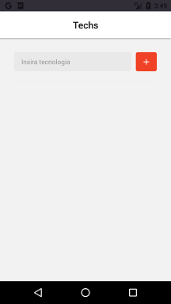
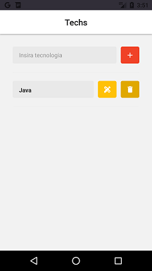
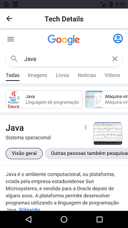

# DIONavigation
Projeto desenvolvido no Lab "Entendendo de Métodos HTTPS e Navegação com React Native" da [Digital Innovation One](https://digitalinnovation.one).

Esta aplicação permite inserir suas tecnologias favoritas e fazer pesquisas diretamente no Google.

## Instruções
Depois de obter o projeto na sua máquina local, acesse o diretório raiz do projeto em uma janela de linha de comandos do sistema.
Instale as dependências do projeto:
```bash
yarn
```

Em seguida, abra outra janela de linha de comandos, acesse o diretório do projeto novamente e inicie o Metro Server:
```bash
yarn start
```

Em outra janela de linha de comandos, dentro do diretório do projeto, inicie a aplicação:
```bash
yarn android
```
**Obs:** Para executar a aplicação no iOS, substitua por `yarn ios`.
**Obs:** O dispositivo virtual (android ou ios) deve estar em execução no computador local.

## Principais bibliotecas e dependências de projeto
- React Native
- React Navigation
- React Native Vector Icons
- Axios
- Styled Components

## Screenshots


